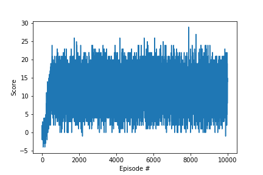

# Project report

## Introduction

The goal of this project is to train an agent to navigate a large square virtual world littered with yellow and blue bananas, and collect only yellow bananas. A reward of +1 is provided for collecting a yellow banana, and a reward of -1 is provided for collecting a blue banana. The goal of the agent is to collect as many yellow bananas as possible while avoiding blue bananas. A succesfully trained agent should score an average of +13 over 100 consecutive episodes. 


## Environment


```
INFO:unityagents:
'Academy' started successfully!
Unity Academy name: Academy
        Number of Brains: 1
        Number of External Brains : 1
        Lesson number : 0
        Reset Parameters :
		
Unity brain name: BananaBrain
        Number of Visual Observations (per agent): 0
        Vector Observation space type: continuous
        Vector Observation space size (per agent): 37
        Number of stacked Vector Observation: 1
        Vector Action space type: discrete
        Vector Action space size (per agent): 4
        Vector Action descriptions: , , , 
```


## Agent Training

### DQN architecture

To train the agent initially I used a vanilla Deep Q Learning as described in original paper. As an input the vector of state is used instead of an image so convolutional neural nework is replaced with deep neural network. The deep neural network has following layers:

- Fully connected layer - input: 37 (state size) output: 128
- Fully connected layer - input: 128 output 64
- Fully connected layer - input: 64 output: 4 (action size)

Parameters used in DQN algorithm:

- Maximum steps per episode: 1000
- Starting epsilion: 1.0
- Ending epsilion: 0.01
- Epsilion decay rate: 0.995

### Training Results

```
-----Training for 10000 episodes using decay rate of 0.995-----

Episode 100	Average Score: 0.01
Episode 200	Average Score: 0.891
Episode 300	Average Score: 4.10
Episode 400	Average Score: 8.24
Episode 500	Average Score: 11.05
Episode 600	Average Score: 12.40
Episode 700	Average Score: 12.72
Episode 800	Average Score: 12.26
Episode 900	Average Score: 12.44
Episode 932	Average Score: 13.04
Environment solved in 832 episodes!
	Average Score: 13.04
```


|  |
|:--:| 
| Plot of average scores across entire training period |

### Trained agent


## Experimenting with Hyperparameters

### Experimenting with DQN Architecture

### Experimenting with the Epsilon-decay rate

## Ideas for future work

1. Extensive hyperparameter optimization
2. Double Deep Q Networks
3. Prioritized Experience Replay
4. Dueling Deep Q Networks
5. RAINBOW Paper
6. Learning from pixels